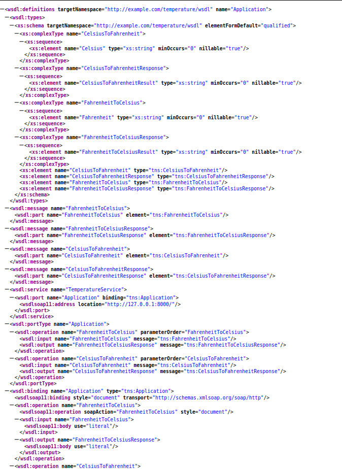
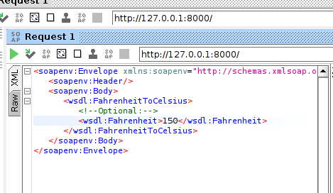
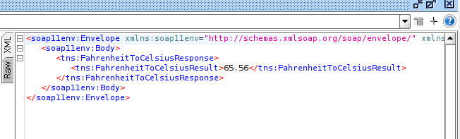

# Temperature SOAP Web Service (Python + Spyne)

## Overview

This project implements a SOAP-based web service for temperature conversion using Python and the Spyne framework.

The service:

* Converts Fahrenheit → Celsius
* Converts Celsius → Fahrenheit
* Uses SOAP XML over HTTP
* Automatically generates WSDL

---

##Technologies Used

* Python 3
* Spyne (SOAP framework)
* lxml (XML validation)
* SoapUI (testing)

---

##Setup Instructions

```bash
git clone https://github.com/fk2295/temp-soap-service.git
cd temp-soap-service

python3 -m venv venv
source venv/bin/activate

pip install -r requirements.txt
```

---

##Run the Service

```bash
python -m temp_soap_service.app
```

---

##Service Endpoint

```txt
http://127.0.0.1:8000/
```

---

##WSDL

```txt
http://127.0.0.1:8000/?wsdl
```

Open this in your browser to view the XML service description.

---

## Operations

* FahrenheitToCelsius
* CelsiusToFahrenheit

---

## Example SOAP Request

```xml
<soapenv:Envelope xmlns:soapenv="http://schemas.xmlsoap.org/soap/envelope/"
                  xmlns:tns="http://example.com/temperature/wsdl">
   <soapenv:Body>
      <tns:FahrenheitToCelsius>
         <tns:Fahrenheit>98.6</tns:Fahrenheit>
      </tns:FahrenheitToCelsius>
   </soapenv:Body>
</soapenv:Envelope>
```

---

## Expected Response

```xml
<FahrenheitToCelsiusResult>37.00</FahrenheitToCelsiusResult>
```

---

## Testing (SoapUI)

1. Open SoapUI
2. Create New SOAP Project
3. Enter WSDL:

```txt
http://127.0.0.1:8000/?wsdl
```

4. Run operations:

   * FahrenheitToCelsius
   * CelsiusToFahrenheit

---

##Screenshots

### WSDL in Browser



### SoapUI Request



### SoapUI Response



---

##Project Structure

```txt
src/temp_soap_service/
```

* `service.py` → conversion logic
* `app.py` → SOAP service

---

##License

MIT License

---

##Author

fk2295

